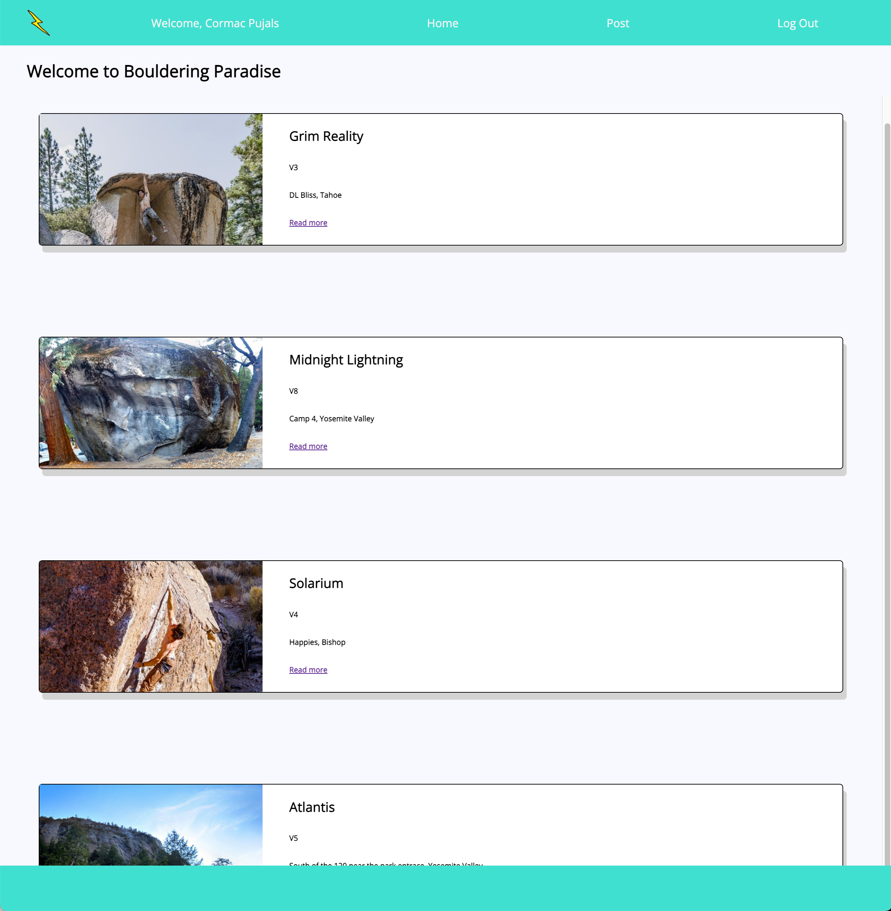
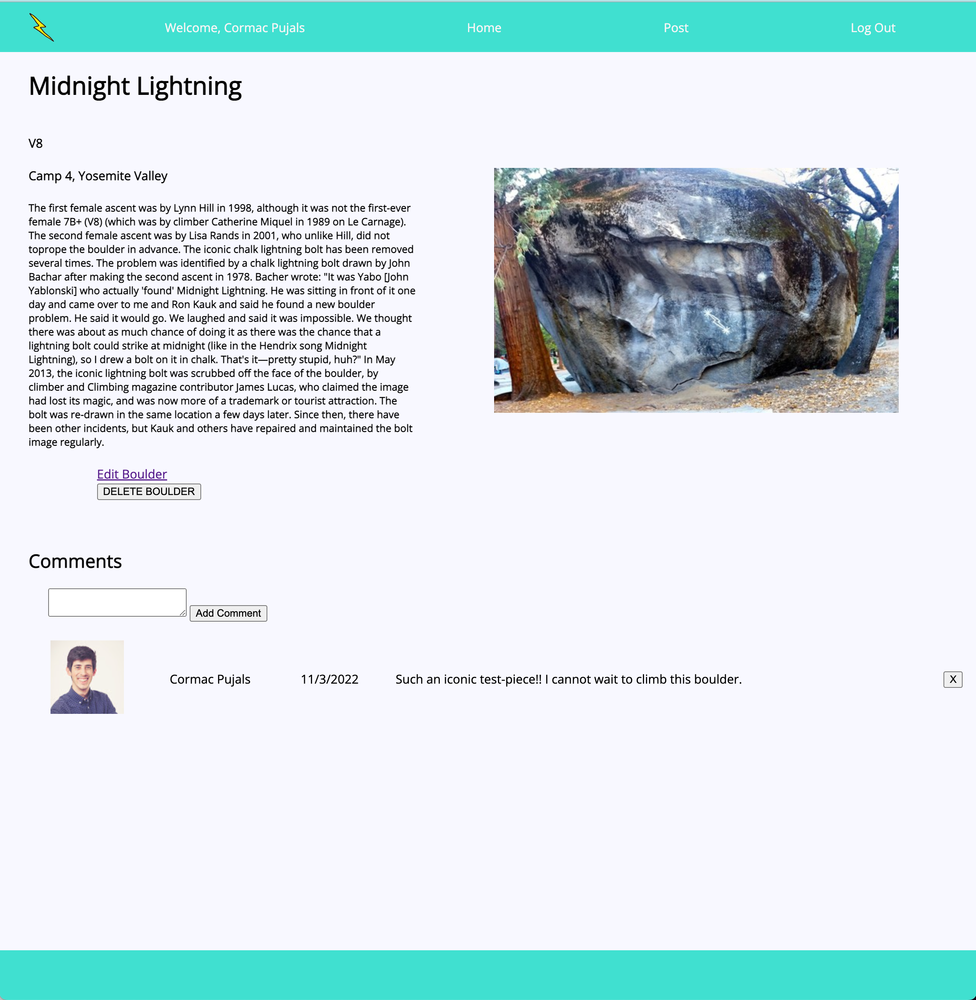

# BOULDERING PARADISE

Bouldering Paradise is fun website designed to offer climbers a way to connect 
over their shared passion for bouldering. Folks can post photos, descriptions, 
comments, and more! 

# Screenshots:

Here is the landing page for a visitor! Folks can sign in with Google to access 
more features.

Folks can click on "read more" to access further details about the post and a 
full-size image of the climb.

Creating a post is easy! Just fill out the five fields and boom!! You are a 
contributor.

Clicking the edit post link will take you to a form where you can edit the
boulder details if you are the author. You may also delete a post (and comments 
on a post) if you are the author.

# Technologies Used

# Planning

Check out my [Trello Board](https://trello.com/b/pYx1URT0/project-2) here to see
how I organized my planning!

# Getting Started

[Click to check out Bouldering Paradise!](https://github.com/cormacpujals/bouldering)

Enjoy! Become a part of the community and create your own posts!

# Next Steps

Here's a link to my [Trello Board](https://trello.com/b/pYx1URT0/project-2)
where I feature icebox items I would love to implement. If you have any 
suggestions, I would love to hear them!

